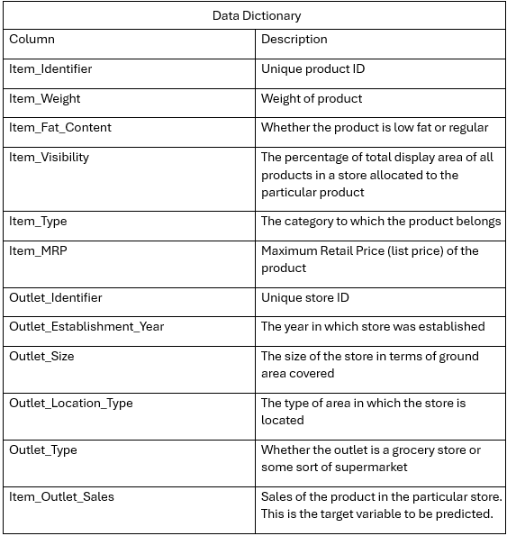
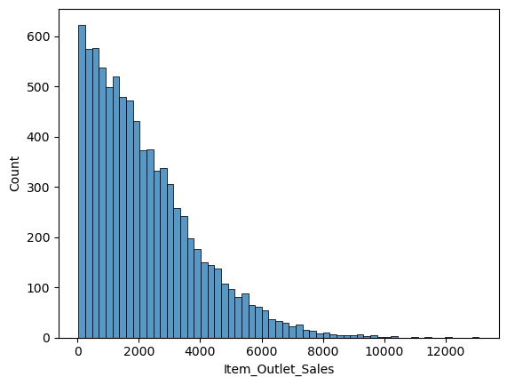
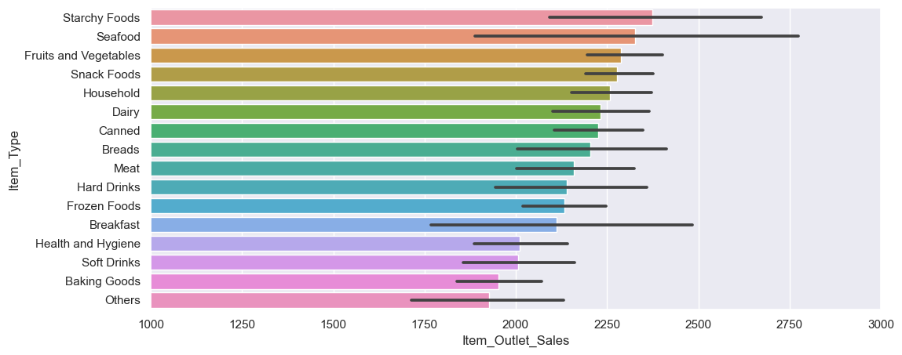
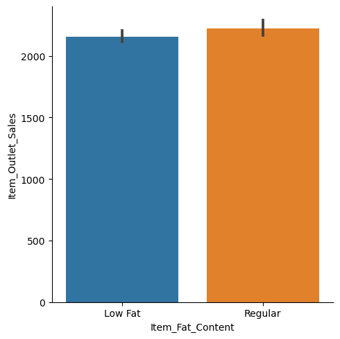
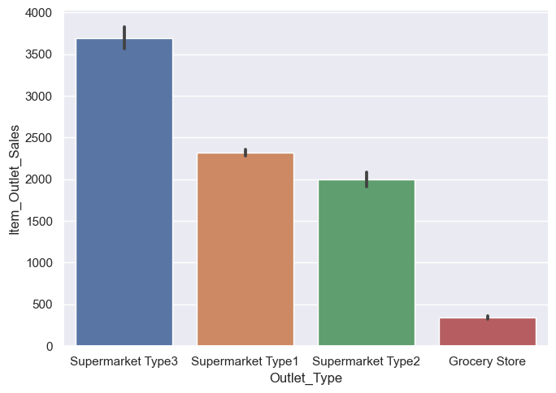
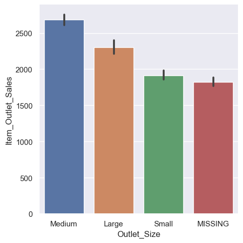

   

# Prediction of Product Sales
Understanding and Modeling Grocery Retail Sales

## Author: David Dyer

## Overview

This is an exploration into the factors that the biggest effect on retail sales for a number of grocery products.

## Data Source

Big Mart Sales Prediction: https://datahack.analyticsvidhya.com/contest/practice-problem-big-mart-sales-iii/

The dataset is 2013 sales data for 1559 products across 10 stores in different cities.

For this dataset, there were 8523 rows and 12 columns.

## Data Dictionary

    

## To prepare this data, the data was cleaned, and the following processes were performed:

### Exploratory Data Analysis
    - During the exploratory data analysis, a boxplot and histogram was visualized for each numeric datatype column. 
    - Also, a barplot was visualized for each categorical column. 
    - This gave a good baseline for all of the numeric and categorical columns for univariate EDA.
    

 
  

This histogram shows that the majority of stores sold about 1500-1800 of the majority of products.

 ### Expanatory Data Analysis
    - To visualize the data for explantory purposes, three bargraphs were chosen and one linegraph was chosen.
    - The bargraphs were chosen to show how the categories compare to each other. 
    - Finally, a linegraph was chosen to show the trend of salaries over the past three years. 

## Explanatory Visuals

 
  

The five highest selling product groups and their sales are as follows:

  - Starchy Foods: `2374.33`
  - Seafood: `2326.06`
  - Fruits and Vegetables: `2289.01`
  - Snack Foods: `2277.32`
  - Household: `2258.78`

The five lowest selling product groups and their sales are as follows: 

  - Breakfast: `2111.81`
  - Health and Hygiene: `2010.00`
  - Soft Drinks: `2006.51`
  - Baking Goods: `1952.97`
  - Others: `1926.14`

Interestingly, the "Low Fat" distinction had very little effect on product sales.

 
  

These two graphs show that the most sales occurred at medium-size type 3 supermarkets.

 
  

 
  

 ### Maching Learning Using the Following Models:
    - Linear Regression Model
    - Random Forest Regressor Model
    - Tuned Random Forest Regressor Model
    - GridSearch-Optimized Random Forest Regressor Model
    
## Models Evaluated & Results

- Linear Regression Model (Testing Set):
  - MAE = 10,895,680,294.955
  - MSE = 63,245,858,807,140,010,950,656.000
  - RMSE = 251,487,293,530.190
  - R^2 = -23,122,029,410,410,080.000

- Random Forest Regressor Model (Testing Set):
  - MAE = 779.390
  - MSE = 1,252,662.371
  - RMSE = 1,119.224
  - R^2 = 0.542

- Tuned Random Forest Regressor Model (Testing Set):
  - MAE = 779.390
  - MSE = 1,252,662.371
  - RMSE = 1,119.224
  - R^2 = 0.542

- Optimized Random Forest Regressor Model (Testing Set):
  - MAE = 756.662
  - MSE = 1,162,612.009
  - RMSE = 1,078.245
  - R^2 = 0.601

- The Final Model Chosen was a `Optimized Random Forest Regressor Model` with the n_estimators tuned to 100.
- For the testing set on the model, `60.1%` of the variance in y was explained by x. 
- The Mean Absolute Error was off by about `756` sales.
- The Mean Squared Error was `1,162,612` sales.
- The Root Mean Squared Error had a calculation of `1,078` sales.

Using this model to make predictions about future product sales would be somewhat reliable, with an expected accuracy per prediction of roughly **60%**. This indicates that while we are on the right track, our training data is likely missing crucial features necessary to more accurately forecast sales.

## Recommendations

Sales Insights

- Medium-sized type 3 supermarkets may be the most effective sales environments across all products
- Regular and non-fat versions of products should be stocked in roughly equal numbers

Model Performance
- Overall, the best model is definitely the tuned Random Forest Regressor Model. There was still some bias in the model, but by far it outperformed the linear regression model. 

## Limitations & Next Steps

The accuracy of this model is limited by the data available for training. This model could be improved substantially by re-training on either a larger dataset, or one with more visisblity into relevant features.

## For Further Information

For any additional questions, please contact: 
- David Dyer
- dsdyer@gmail.com
